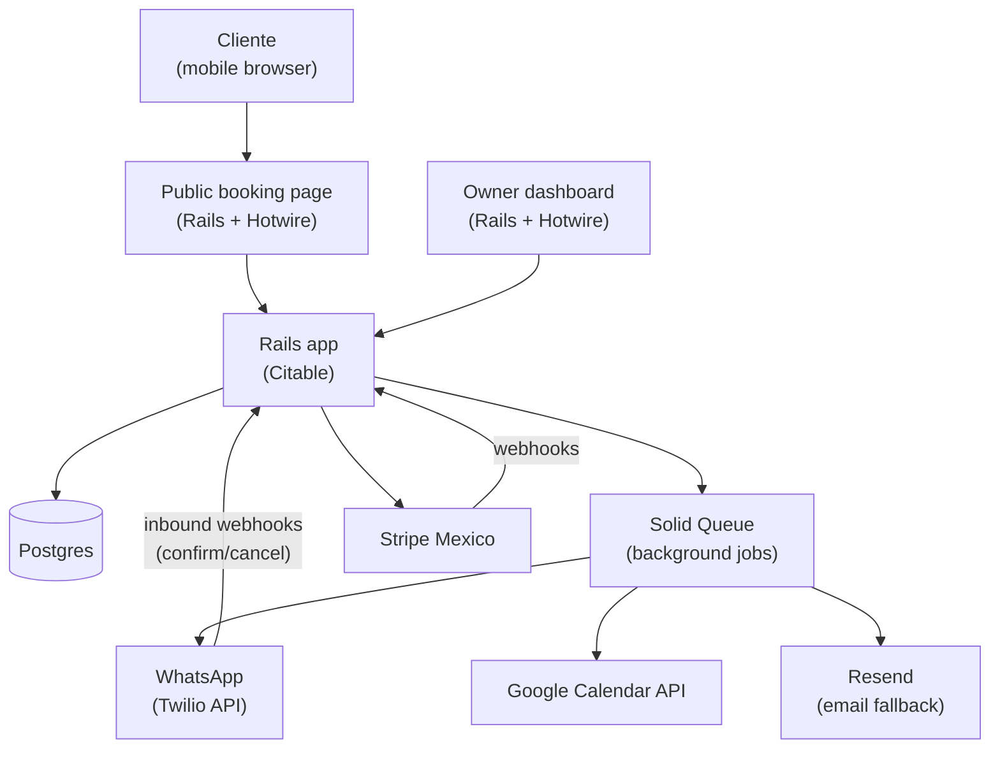
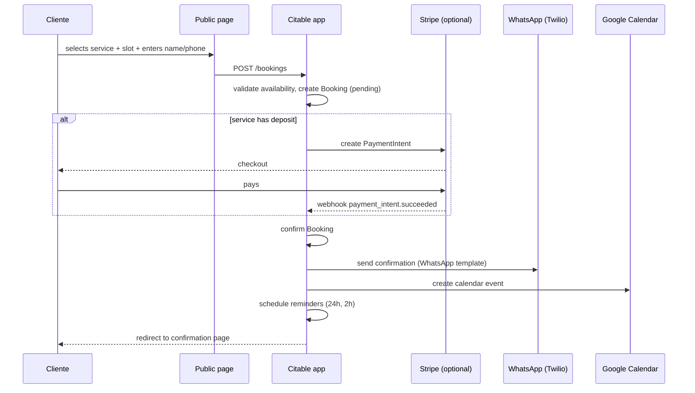
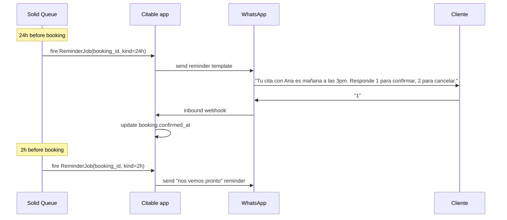

# Design Spec: Citable - WhatsApp-Native Booking + Light CRM for Mexican Local Services

Date: 2026-04-17
Status: Approved via brainstorming (awaiting written-spec review)
Owner: jolell (solo founder)

---

## 1. Thesis

A Spanish-first, WhatsApp-native appointment booking and light CRM for Mexican local-service businesses, with a genuinely usable free tier.

Calendly and Acuity are English-first and have zero WhatsApp integration. Jobber and Housecall Pro are English-only and start at ~USD $50/mo, well above what Mexican solo operators will pay. AgendaPro is the closest Spanish-speaking competitor but is beauty-vertical-leaning and has no free tier. The real incumbent for our target user is **WhatsApp + Google Sheets + libreta**, which means our true competition is manual work, not another SaaS.

The gap: the tool Mexican plomeros, estilistas, paseadores de perros, tutores, and técnicos actually want - running on WhatsApp, in Spanish, for free or cheap.

## 2. Target User

### Primary persona: "Ana, la estilista de la colonia"

- Runs a 1-chair salon from her home or a small local shop
- 30-80 active clients, mostly repeat
- Books everything through WhatsApp today
- Tracks appointments in a paper notebook and/or Google Calendar
- Forgets occasional appointments, has ~15% no-show rate
- Monthly revenue MXN $15,000-40,000; not price-insensitive
- iPhone or mid-range Android; uses Instagram for marketing
- Speaks and reads only Spanish comfortably

### Secondary persona: "Luis, el dueño de un equipo de 3 técnicos"

- Runs A/C repair / plumbing / electrical with 2-3 techs
- Needs to see all techs' calendars in one place
- Customer history matters (past jobs, service addresses, preferred tech)
- Collects a deposit sometimes; mostly paid on arrival

### Beachhead acquisition

First 100 users via:

- Instagram / TikTok content aimed at Mexican SMB owners ("deja de perder citas")
- WhatsApp community groups for local businesses
- Partnerships with 1-2 local Mexican SMB influencers or marketing accounts

## 3. Differentiators (Ranked)

1. **WhatsApp-first communication** - confirmations, reminders, cancellations, and reschedules all happen in WhatsApp. No competitor in our price band does this natively.
2. **Spanish-native UX** - Mexican idioms, tone, and terminology. Not a translation layer over an English product.
3. **Cash-first booking flow** - bookings default to "pagar en el lugar"; online deposit via Stripe MX is optional. Matches real Mexican local-service workflows.
4. **Genuinely usable free tier** - multiple services, recurring bookings, and basic multi-staff remain on free. Users don't have to upgrade to use the product, only to scale.
5. **Service-business-native from v1** - service addresses on bookings, recurring weekly/biweekly/monthly appointments, multi-staff calendars.

## 4. System Architecture

### High-level

### Components

- **Public booking page** - subdomain per tenant (`ana.citable.mx`) + custom path; Spanish-only; mobile-first. Renders available slots, service picker, deposit flow.
- **Owner dashboard** - calendar view, customer list, service editor, staff management, settings. Hotwire-reactive; no SPA.
- **Background jobs (Solid Queue)** - schedules reminders (24h and 2h before), Google Calendar sync, webhook delivery retries.
- **WhatsApp integration (Twilio)** - sends templated messages, receives inbound replies via webhook, handles confirm/cancel/reschedule intents.
- **Stripe Mexico** - optional deposits at booking time; webhooks update booking status.
- **Google Calendar** - two-way sync per staff member; OAuth stored per user.

### Multi-tenancy model

- Row-level tenancy with `acts_as_tenant` scoped on `account_id`.
- One `Account` per business; one or more `Users` per account (owner + staff).
- Subdomain routing resolves tenant before any query executes.
- All queries automatically scoped; explicit `ActsAsTenant.with_tenant` blocks in jobs.

### Core data model (sketch)

- `Account` - business (name, subdomain, timezone, locale=es-MX, plan, whatsapp_quota_used)
- `User` - owner or staff (email, phone, role, google_oauth_tokens)
- `Service` - offered service (name, duration, price, requires_address, deposit_amount)
- `StaffAvailability` - per-user weekly availability + exceptions
- `Customer` - end customer (name, phone, notes, custom_fields, tags)
- `Booking` - appointment (customer, service, staff, starts_at, ends_at, status, address, deposit_state, recurrence_rule_id)
- `RecurrenceRule` - weekly/biweekly/monthly pattern + end date
- `MessageLog` - every WhatsApp/email sent or received, linked to booking/customer
- `ReminderSchedule` - rows representing jobs enqueued at 24h/2h before booking

### Data flow: booking happy path

### Reminder flow

## 5. V1 Feature Scope (MVP)

### In scope

- Sign up / onboarding flow in Spanish, under 5 minutes to a live booking page
- Public booking page per business (subdomain + custom path)
- Multiple services with duration, price, optional service address, optional deposit
- Customer records: contact, full booking history, notes, custom fields, tags
- Recurring appointments (weekly, biweekly, monthly; with configurable end date)
- Multi-staff calendars with per-staff availability and booking assignment
- WhatsApp confirmations and reminders (24h and 2h before)
- WhatsApp reply handling: confirm (`1`), cancel (`2`), reschedule link
- Email fallback when WhatsApp quota exhausted or delivery fails
- Optional Stripe MX deposits (cash-first by default)
- Google Calendar two-way sync (per staff user)
- Free tier quota enforcement (services, staff, monthly WhatsApp message count)
- Billing / upgrade flow via Stripe subscription

### Out of scope (deliberate non-goals)

- Invoicing / facturación CFDI / SAT integration
- Quotes / estimates
- Dispatching, routing, or map views
- Full CRM pipelines (deals, stages)
- Native iOS/Android apps (mobile web only)
- English UI
- Multi-currency (MXN only)
- iCloud / Outlook sync (Google only in v1)
- MercadoPago (deferred to v1.1)
- SMS fallback (deferred to v1.1; email is fallback in v1)
- Bulk WhatsApp broadcasts (deferred to v1.2)

## 6. Tech Stack

- **Framework**: Ruby on Rails 8.1+ with Hotwire (Turbo + Stimulus)
- **Database**: Postgres 15+
- **Background jobs**: Solid Queue (Rails-native, no Redis required for v1)
- **Styling**: TailwindCSS (Rails 8 default)
- **Auth**: Devise; multi-tenancy via `acts_as_tenant` scoped on `account_id`
- **WhatsApp**: Twilio WhatsApp Business API (templated messages + inbound webhooks)
- **Payments**: Stripe Mexico (Payment Intents API for deposits, Billing for subscriptions)
- **Email**: Resend (transactional only; no marketing in v1)
- **Hosting**: Hatchbox on a DigitalOcean droplet OR Render (managed Postgres)
- **Monitoring**: Sentry for errors; Rails `rails/info` for ops; Honeybadger optional
- **CI**: GitHub Actions (rspec + rubocop + brakeman)

### Why Rails over alternatives

- CRUD-heavy, multi-tenant SaaS with lots of forms and admin views - Rails sweet spot
- Hotwire eliminates the need for a separate React frontend, cutting solo-founder scope ~40%
- Strong gem ecosystem for multi-tenancy (`acts_as_tenant`), auth (Devise), payments (`stripe-ruby`), and Twilio
- Solo-founder velocity matters more than theoretical scalability at this stage

## 7. Security & Privacy

- **Jurisdiction**: Mexico. Applicable law: LFPDPPP (Ley Federal de Protección de Datos Personales en Posesión de los Particulares).
- **PII handled**: business owner name/email/phone, end-customer name/phone, booking history, optional notes (may contain health or sensitive info at owner's discretion), payment metadata (no full card data - Stripe holds it).
- **Data residency**: v1 ships with US-based hosting (Render or Hatchbox on DO); evaluate MX region or AWS `mx-central-1` if/when required by customer contracts.
- **Privacy notice**: public privacy policy in Spanish at `/privacidad`, aviso de privacidad per LFPDPPP requirements.
- **Access controls**: role-based (owner vs. staff) on the dashboard; multi-tenant scoping on every query.
- **Password storage**: bcrypt via Devise.
- **Secrets**: Rails encrypted credentials; Stripe/Twilio keys never in source.
- **Backups**: daily automated Postgres backups (provider-managed).
- **Audit**: append-only `MessageLog` for all comms; booking status history tracked.

## 8. Pricing Model

- **Libre (free)**: up to 3 services, 2 staff, unlimited bookings, 100 business-initiated WhatsApp conversations/month (per Meta's billing model - a "conversation" is a 24h window opened by an outbound template), Citable subdomain, basic support.
- **Pro (target MXN $299/mo)**: unlimited services, unlimited staff, 1,000 WhatsApp conversations/month, custom branding, custom domain, priority support.
- **Overage in v1**: none. When the monthly quota is exhausted, outbound WhatsApp sends fall back to email automatically; no bookings are blocked. Overage pricing is deferred to v1.1 once real Twilio Mexico WhatsApp pricing has been validated.
- **Customer-facing label**: "mensajes" in UI copy (simpler mental model); internal accounting uses "conversations" to match Meta billing.

Entry price is deliberately below AgendaPro (~USD $25+/mo) and well below Jobber ($39+/mo), while remaining sustainable at Twilio's Mexican WhatsApp rates.

## 9. Phased Roadmap

- **MVP** (~8-10 weeks solo, ~20-30 hrs/wk): booking page, customer records, WhatsApp reminders, Google Calendar sync, optional Stripe deposits, free + Pro tier billing.
- **v1.1** (+4 weeks): MercadoPago, SMS fallback via Twilio, recurring appointments polish, customer import from CSV.
- **v1.2**: customer tags/segments, bulk WhatsApp broadcasts (templated), basic analytics dashboard.
- **v2**: team routing, WhatsApp chatbot booking (customers book via DM), LATAM expansion (CO, AR, CL), CFDI facturación integration.

## 10. Key Risks

1. **WhatsApp Business API approval** - Meta template approval can take days to weeks. Mitigation: submit templates the first week of development; have email-only fallback ready.
2. **Twilio Mexico WhatsApp pricing** - per-message cost determines free-tier economics. Mitigation: validate pricing in week 1 before finalizing the 100/mo allowance; move to 360dialog or direct Meta if Twilio costs blow up the unit economics.
3. **Solo founder velocity** - 8-10 week MVP assumes 20-30 hrs/wk. Mitigation: ruthlessly defer everything in v1.1+; do not let scope creep into MVP.
4. **Stripe Mexico onboarding latency** - Stripe Mexico KYB can take days. Mitigation: start Stripe onboarding in week 1.
5. **Tenant data leakage** - the #1 multi-tenant SaaS bug. Mitigation: `acts_as_tenant` with `require_tenant` enabled globally; integration tests that attempt cross-tenant reads and assert they fail.
6. **Reminder cost vs. value** - if WhatsApp messages cost more than the value of a prevented no-show, the model breaks. Mitigation: only send reminders for bookings worth more than the message cost; track no-show rate reduction.

## 11. Open Questions

- Custom-domain support in v1 or defer to v1.1? (default: v1 for Pro tier, managed via Cloudflare SaaS or similar)
- How to handle staff without smartphones receiving booking notifications? (default: email-only notifications for those staff)
- Whether to allow customers to self-serve reschedule via WhatsApp button, or require the link. (default: link for v1, native button in v1.2)

## 12. Success Criteria (for MVP launch)

- 20 pilot accounts onboarded in Mexico within 30 days of launch
- End-to-end booking → WhatsApp confirmation → reminder → check-in flow works with no manual steps
- Free → Pro conversion >= 8% within 60 days of signup (industry avg is ~4-7% for freemium SaaS)
- No-show rate reduction of >= 25% vs. customer's self-reported baseline
- P95 booking page load < 2s on 4G in Mexico
- Zero cross-tenant data leaks in the first 90 days

